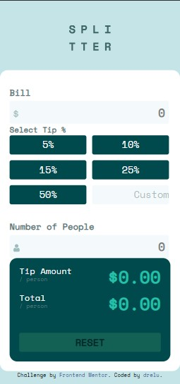

# Frontend Mentor - Tip calculator app solution

This is a solution to the [Tip calculator app challenge on Frontend Mentor](https://www.frontendmentor.io/challenges/tip-calculator-app-ugJNGbJUX). Frontend Mentor challenges help you improve your coding skills by building realistic projects.

## Table of contents

- [Overview](#overview)
  - [The challenge](#the-challenge)
  - [Screenshot](#screenshot)
  - [Links](#links)
- [My process](#my-process)
  - [Built with](#built-with)
  - [What I learned](#what-i-learned)
  - [Continued development](#continued-development)
  - [Useful resources](#useful-resources)
- [Author](#author)

## Overview

### The challenge

Users should be able to:

- View the optimal layout for the app depending on their device's screen size
- See hover states for all interactive elements on the page
- Calculate the correct tip and total cost of the bill per person

### Screenshot

### Links

- Solution URL: [Github](https://github.com/dreelu/Tip-Calculator-App)
- Live Site URL: [Github Pages](https://dreelu.github.io/Tip-Calculator-App/src/)

## My process

### Built with

- Semantic HTML5 markup
- CSS custom properties
- Flexbox
- CSS Grid
- Mobile-first workflow
- Raw JavaScript

### What I learned

I don't think I really learned anything new, but this project was a great experience to reinforce the knowledge I had acquired before.

### Continued development

Functions and methods in JavaScript are powerful tools to learn how to use. I intend to study them further in the near future.

### Useful resources

- [MDN Web Docs](https://developer.mozilla.org/pt-BR/docs/Web/JavaScript/Reference/Functions/Arrow_functions) - Help me to understand arrow functions.

## Author

- Frontend Mentor - [@dreelu](https://www.frontendmentor.io/profile/dreelu)
- Twitter - [@anledruis](https://www.twitter.com/anledruis)
